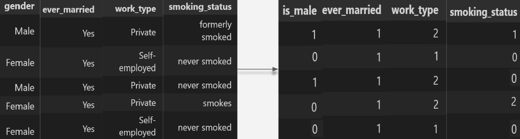
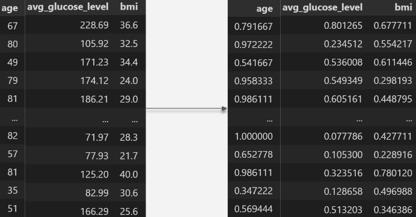
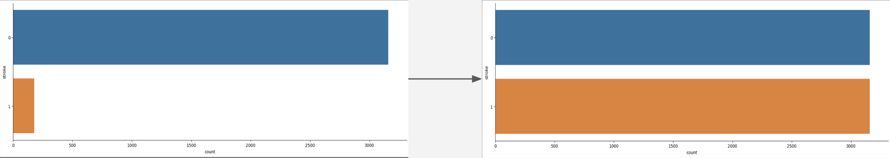
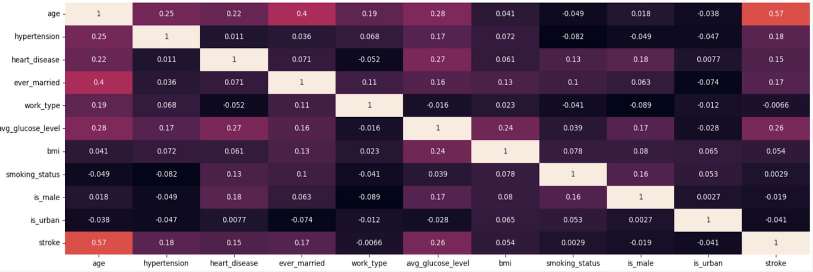
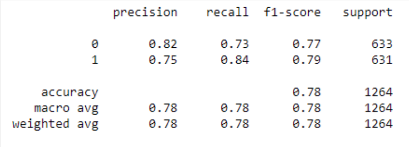
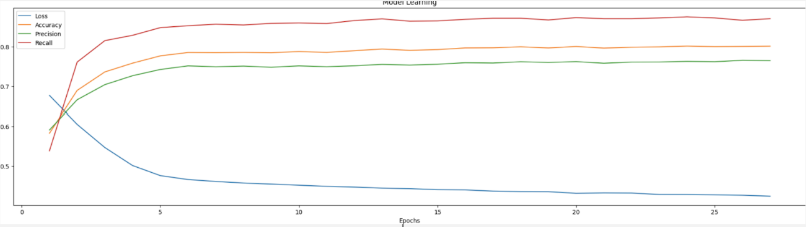
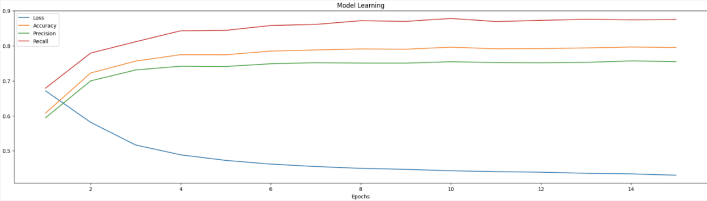

# DSAI MINI PROJECT - STROKE PREDICTION

 Nanyang Technological Univeristy  
 School of Computer Science and Engineering  
 Lab: B133  
 Team: 10  

Members:
  1. Yong Shun Jie (@Ruin9999)
  2. Wu Wei Jie (@Weitucky)
---
### Description 
This repo contains all the material used for our SC1015 Data Science and Artificial Intelligence Module.  

This README will briefly describe the contents of the project, what we learnt, what we have accomplished, and a succint description of our thought process when working on the project.

---
### Table of Contents
  1. [Problem Formulation](https://github.com/Ruin9999/stroke-prediction#Problem-Formulation)
  2. [Data Preparation & Cleaning](https://github.com/Ruin9999/stroke-prediction#Data-Preparations)
  3. [Exploratory Data Analysis](https://github.com/Ruin9999/stroke-prediction#Data-Analysis)
  4. [Logistic Regression Model](https://github.com/Ruin9999/stroke-prediction#Logistic-Regression)
  5. [Neural Network Model](https://github.com/Ruin9999/stroke-prediction#Neural-Network)
  6. [Data Driven Insights](https://github.com/Ruin9999/stroke-prediction#Insights)
  7. [Lessons Learnt](https://github.com/Ruin9999/stroke-prediction#Lessons-Learnt)
  8. [References](https://github.com/Ruin9999/stroke-prediction#References)

---
### Problem Formulation

Stroke is a serious medical condition where the bloodflow to the brain is disrupted, caused by a blocked or ruptured blood vessel in the brain, leading to the permanent death of brain cells, causing lasting negative effects for our everyday lives. Stroke has been an issue for both or families, therefore, our team decided to try and see if it is possible to consistently predict the chances of an individual experiencing a stroke.

**Question** : Is it possible to predict the likelihood of someone experiencing a stroke ?  
**Dataset** : [Stroke Prediction Dataset on Kaggle](https://www.kaggle.com/datasets/fedesoriano/stroke-prediction-dataset).

---
### Data Preparations
To prepare our data for our machine learning models, we did these few steps:
  1. Culling of `NULL` values.
  2. Dropping of obviously obsolete data.
  3. Encoding of `Categorical` values.
  4. Normalization of `Numerical` values.
  5. Upsampled using [SMOTE](https://towardsdatascience.com/smote-fdce2f605729).
 
#### Encoding

#### Normalizing

#### Upsampling

---
### Data Analysis
Looking at the correlations between our features and output, we realize that there were a few variables with a correlation. Those features being:
  1. `Age`
  2. `Hypertension`
  3. `Heart Disease`
  4. `Ever Married`
  5.  `Average Glucose Level`

---
### Logistic Regression
Since we are trying to predict a categorical value (if an individual will experience stroke or not), our team decided to use a [Logistic Regression](https://developers.google.com/machine-learning/crash-course/logistic-regression/video-lecture) model.

Using a train/test split of `20/80`, we managed to score a prediction accuracy of `78%`.

---
### Neural Network
Our team thought that getting `78%` for our prediction accuracy was great. However, we wanted to try and see if another machine learning model could be used to better predict our outcome.

We chose to use a [Neural Network](https://machinelearningmastery.com/binary-classification-tutorial-with-the-keras-deep-learning-library/) model not only because our dataset is moderately large, but also because neural networks are good for modeling non-linear data which Linear Regession cannot.

We :
  1. Decided on an **Input Layer** with `9` neurons, 2 **Hidden Layers** with `18` and `9` neurons respectively.
  2. Tuned the number of `epochs` to try and reduce `overfiting`.

#### Before

#### After

---
### Insights
Thanks to our data exploration, we learnt a few interesting things: 
  1. BMI has no direct correlation with the chance of having stroke.
  2. Age plays a huge part in determining the chances of an individual experiencing a stroke.
  3. Is is possible to predict stroke, however we might need more features and observations to more reliably get results.

---
### Lessons Learnt
 1. Logistic Regression is a good machine learning model for categorizing values.
 2. We need to tune our neural network's `epochs` and `architecture` to get better results.
 3. It is important to `normalize` your values when prepping data as features with large ranges could easily overpower other variables.
 4. `One hot encoding` could be used instead when encoding our multi-level categorical values.
 5. Determining `correlation` on a `skewed` dataset is a terrible way to look for relationships.
 6. There are many ways so fix skewed dataset, 2 being `undersampling` and `oversampling`.  

---
### [References]
- https://towardsdatascience.com/smote-fdce2f605729
- https://www.cdc.gov/stroke/about.htm#:~:text=A%20stroke%2C%20sometimes%20called%20a,term%20disability%2C%20or%20even%20death.
- https://www.geeksforgeeks.org/advantages-and-disadvantages-of-logistic-regression/
- https://subscription.packtpub.com/book/big-data-&-business-intelligence/9781788397872/1/ch01lvl1sec27/pros-and-cons-of-neural-networks
- https://pub.towardsai.net/binary-image-classification-with-tensorflow-2cc6555e55e8?gi=6ce43d139013
- https://www.tensorflow.org/guide/core/logistic_regression_core
- https://machinelearningmastery.com/binary-classification-tutorial-with-the-keras-deep-learning-library/
- https://www.analyticsvidhya.com/blog/2021/11/neural-network-for-classification-with-tensorflow/
- https://stats.stackexchange.com/questions/181/how-to-choose-the-number-of-hidden-layers-and-nodes-in-a-feedforward-neural-netw
- https://gretel.ai/gretel-synthetics-faqs/how-many-epochs-should-i-train-my-model-with#:~:text=The%20right%20number%20of%20epochs,again%20with%20a%20higher%20value.
- https://developers.google.com/machine-learning/crash-course/logistic-regression/video-lecture
